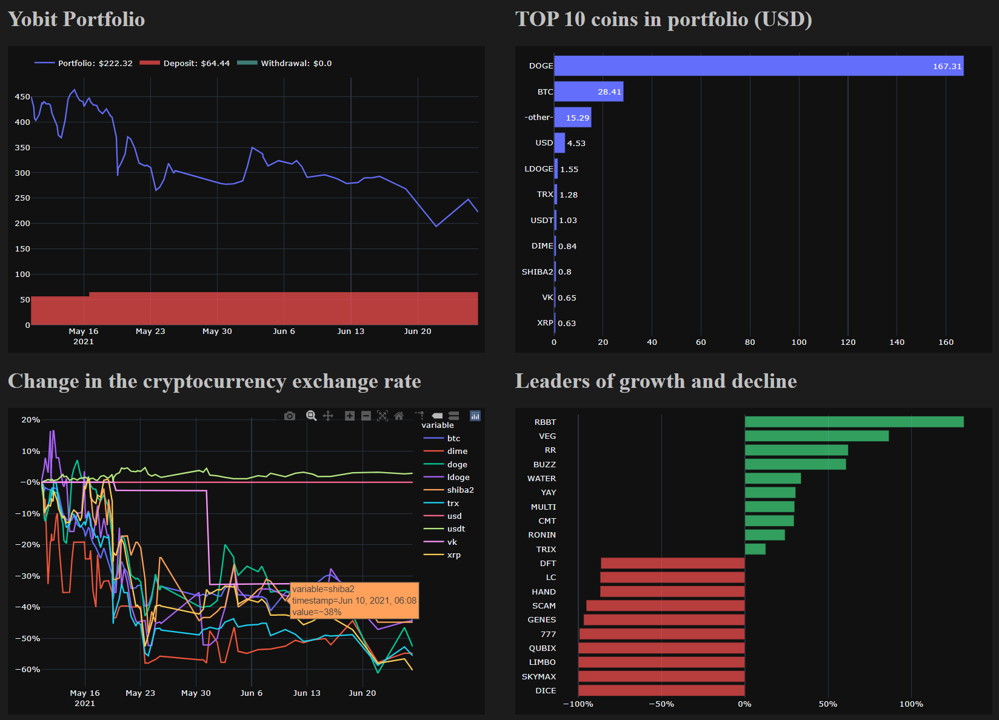

# YobitTracker

## What's it?
Tracker of the Yobit exchange. Uses the API to go to the site yobit.net and collects data to build a dashboard of changes to your portfolio.

## How to use it?

1. Sign in to the Yobit website, go to the page https://yobit.net/en/api/keys/, select `info only` (this is important for security) and click `Create new key`. You will receive a `Key` and a `Secret` (do not pass them to anyone).
2. Сreate a file `key.txt` in the root. Copy the received `Key` to the first line of the file, and `Secret` to the second line. You got them in the step above. Сохраните `key.txt`
3. (optional) Manually fill in the balance.csv I / O file
4. Run the script `1_dataupdate.py`. Wait for it to be completed.

> To launch .py scripts you must have Python installed. Open the folder in the command line and type the name of the script. For example, `1_dataupdate.py` . You may need to install missing modules.

5. Run the script `2_chartcreate.py`. Wait for it to be completed.

6. The dashboard is ready! Go to the `dashboard` directory and open the file `index.html` in any browser.

> __Note__: Some dashboard charts require regular scripts to be run to display changes. For example, you can run the scripts from step 4 and 5 once a day and see the change after a while. You can set up a regular start in the scheduler.

## Why is it safe?

* For the script to work, API keys with the "info" privilege are enough. Such a key can only receive information, but not perform actions with the account.
* API keys and data received by scripts are stored exclusively locally on your PC.

## Example

